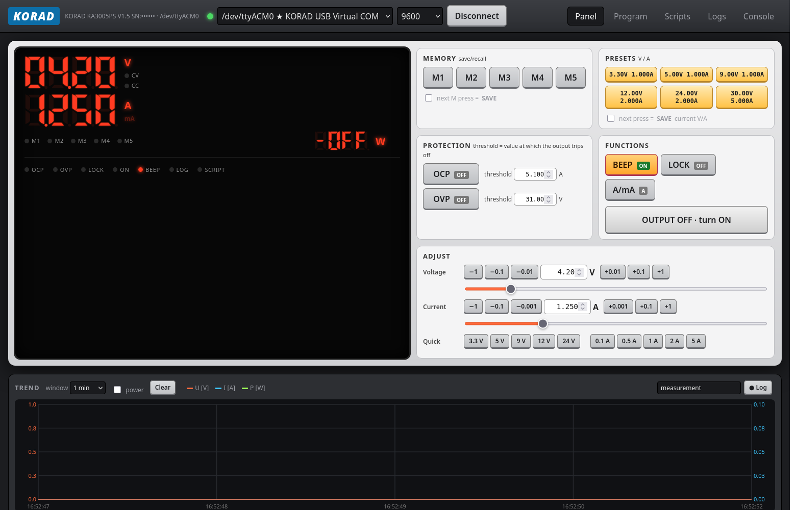
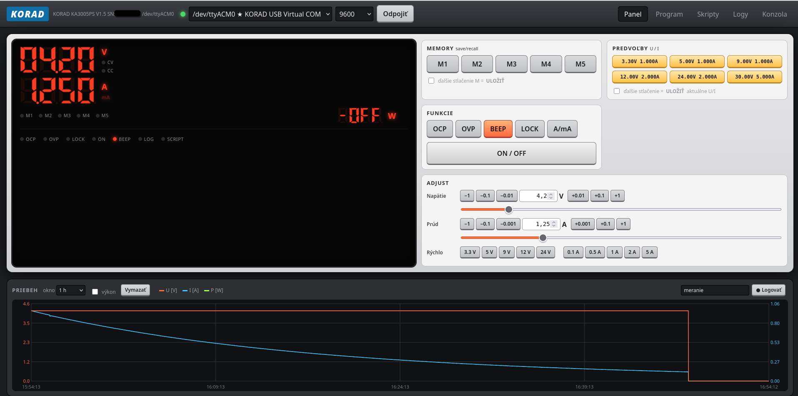

# KORAD KA3005P/PS – ovládanie zdroja cez USB (Linux / macOS / Windows)

GUI pre laboratórny zdroj **KORAD KA3005P / KA3005PS** (a klony: Tenma 72-2535, RND 320-KA3005P, Velleman LABPS3005D…)
pripojený cez USB. Jedna aplikácia, tri platformy: na Windows a macOS sa otvorí ako natívne okno, na Linuxe v prehliadači.
Používateľské rozhranie je v angličtine.



Nabíjanie Li-ion článku skriptom `10_charge_liion.py`: CV fáza 4.20 V, prúd klesá z 1.25 A, pri 0.125 A (C/20) skript vypne výstup.




## 1. Stiahnutie hotovej aplikácie (bez inštalácie Pythonu)

Hotové súbory sú v **[Releases](https://github.com/vladcis/korad/releases/latest)**. Vyber podľa systému:

| Systém | Súbor | Ako spustiť |
|---|---|---|
| **Windows 10/11** (64-bit) | `korad-windows-x64.exe` | Dvojklik. Pri prvom spustení SmartScreen: *Ďalšie informácie → Spustiť aj tak* (aplikácia nie je podpísaná). |
| **macOS** (Apple Silicon M1–M4) | `korad-macos-arm64.zip` | Rozbaliť, `korad.app` presunúť do Aplikácií. Prvýkrát **pravý klik → Otvoriť** (Gatekeeper), alebo v Termináli `xattr -d com.apple.quarantine /Applications/korad.app`. Intel Mac: spusti zo zdrojákov (bod 2). |
| **Linux** (x86-64, glibc ≥ 2.35: Ubuntu 22.04+, Debian 12+, Fedora 36+…) | `korad-linux-x86_64` | `chmod +x korad-linux-x86_64 && ./korad-linux-x86_64` – spustí sa server a otvorí sa prehliadač. |

Po spustení aplikácia sama nájde zdroj na USB. Ak nie, vyber port v hornej lište a klikni **Pripojiť**.

**Kde sú moje skripty a logy** (aplikácia si ich vytvorí pri prvom spustení, cesta je aj v konzole aplikácie):

| Systém | priečinok |
|---|---|
| Windows | `%APPDATA%\Korad\` (napr. `C:\Users\meno\AppData\Roaming\Korad\`) |
| macOS | `~/Library/Application Support/Korad/` |
| Linux | `~/.local/share/korad/` |

Iný priečinok nastavíš premennou prostredia `KORAD_HOME`.

### Čo treba na jednotlivých systémoch

**Windows 11** – nič. Zdroj sa po pripojení objaví ako `COMx` (ovládač `usbser` je súčasťou Windows).
Natívne okno používa WebView2, ktorý je vo Windows 11 vstavaný (vo Windows 10 ho prípadne doinštaluje aktualizácia Edge).

**macOS** – nič. Zdroj je `/dev/cu.usbmodemXXXX`. Ak macOS pri pripojení ponúkne „Allow accessory to connect“, povoľ.

**Linux** – prístup k sériovému portu a vypnutie ModemManageru pre zdroj (inak ho skúša ako modem a ruší komunikáciu):
```sh
sudo usermod -aG dialout $USER          # potom sa odhlás a prihlás
sudo curl -o /etc/udev/rules.d/99-korad.rules https://raw.githubusercontent.com/vladcis/korad/main/99-korad.rules
sudo udevadm control --reload && sudo udevadm trigger
```
Linuxová binárka otvára UI v predvolenom prehliadači (natívne okno by vyžadovalo WebKitGTK; zo zdrojákov ho dostaneš cez `pip install pywebview` + `python3-gi gir1.2-webkit2-4.1`).

## 2. Spustenie zo zdrojákov (všetky platformy, aj Intel Mac a Raspberry Pi)

Potrebuješ Python 3.10+ a git (alebo stiahni ZIP cez *Code → Download ZIP*).

**Linux / macOS**
```sh
git clone https://github.com/vladcis/korad.git && cd korad
python3 -m pip install -r requirements.txt       # flask, pyserial
python3 app.py                                   # web server -> http://127.0.0.1:8585
# alebo desktop okno:
python3 -m pip install pywebview                 # Linux navyše: sudo apt install python3-gi gir1.2-webkit2-4.1
python3 desktop.py
```
Na macOS stačí dvojklik na `run.command` (otvorí prehliadač). Python na macOS: `brew install python` alebo inštalátor z python.org.

**Windows**
1. Nainštaluj Python z [python.org](https://www.python.org/downloads/windows/) a zaškrtni **Add python.exe to PATH**.
2. Stiahni repozitár (ZIP alebo `git clone`), v priečinku otvor PowerShell / cmd:
```bat
pip install -r requirements.txt
pip install pywebview        :: voliteľné, natívne okno
python desktop.py            :: natívne okno, alebo:  python app.py  -> http://127.0.0.1:8585
```
Alebo dvojklik na `run.bat` (otvorí prehliadač).

**Voliteľné parametre**: `python app.py --port 9000 --device COM5 --host 0.0.0.0` (`--host 0.0.0.0` sprístupní UI v lokálnej sieti, napr. z tabletu).
Premenná prostredia `KORAD_HIDE_SN=1` skryje v UI sériové číslo zdroja (zdieľanie obrazovky, screenshoty).

## 3. Vlastný build binárky

Na každom OS zvlášť (PyInstaller nevie krížovo kompilovať):
```sh
pip install -r requirements.txt pyinstaller pywebview
python build.py        # -> dist/korad (Linux), dist/korad.exe (Windows), dist/korad.app (macOS)
```
GitHub Actions (`.github/workflows/build.yml`) zostaví všetky tri verzie automaticky pri tagu `v*` a pripojí ich k vydaniu.

## Funkcie
- **Panel** v štýle predného panelu zdroja: 7-segmentový displej U / I / P, indikátory CV, CC, OCP, OVP, ON, LOCK.
  Pri vypnutom výstupe ukazuje nastavené hodnoty, pri zapnutom merané (ako reálny displej).
- Nastavenie U a I (číselne, posuvník, krokovanie), ON/OFF, OCP, OVP, BEEP, A/mA, pamäte M1–M5 (vyvolať / uložiť), 6 predvolieb U/I, živý graf U / I / P.
- **Program** – programovateľný test ako v originálnom softvéri: tabuľka krokov U / I / čas, začiatočný a koncový bod, počet cyklov (0 = nekonečne).
- **Skripty** – Python skripty s objektom `psu` (ukladať, editovať, spúšťať, zastaviť), výstup v reálnom čase.
- **Logy** – CSV logovanie U/I/P s nastaviteľným intervalom, graf aj tabuľka, sťahovanie.
- **Konzola** – priame príkazy zdroju (`VSET1:05.00`, `STATUS?`…), história príkazov a udalostí.
- Ochrany OCP / OVP so zapnutím a nastavením prahu (KA3005PS), tlačidlá ukazujú ZAP/VYP.
- Počas behu skriptu alebo programu je panel zamknutý (ostane len Stop), aby ručný zásah nepokazil meranie.
- Automatické znovupripojenie po výpadku USB, voľba portu a baud rate.

## Skriptovanie
Skripty sú v priečinku `scripts/` (cesta podľa OS vyššie), bežia vo vlákne servera. Dostupné: `psu`, `print`/`log`, `time`, `math`.
Skripty môžu importovať vlastné knižnice `lib_*.py` z toho istého priečinka (načítajú sa nanovo pri každom behu).

| volanie | význam |
|---|---|
| `psu.set_v(12.0)`, `psu.set_i(0.5)`, `psu.set(volts=, amps=)` | nastavenie U [V], I [A] |
| `psu.on()`, `psu.off()`, `psu.output(bool)` | výstup |
| `psu.vout`, `psu.iout`, `psu.power`, `psu.vset`, `psu.iset` | meranie / nastavené hodnoty |
| `psu.status()` | `{"cv","ocp","ovp","output","beep"}` |
| `psu.wait(s)` (= `time.sleep`) | pauza, dá sa prerušiť tlačidlom Stop |
| `psu.ramp_v(od, do, trvanie, step)`, `psu.ramp_i(...)` | lineárna rampa |
| `psu.ocp(b)`, `psu.ovp(b)`, `psu.beep(b)`, `psu.save(n)`, `psu.recall(n)` | funkcie, pamäte 1–5 |
| `psu.set_ocp(A)`, `psu.set_ovp(V)`, `psu.ocp_limit`, `psu.ovp_limit` | prahy ochrán (KA3005PS) |
| `psu.log_start("nazov", interval)`, `psu.log_stop()` | CSV logovanie |
| `psu.raw("VSET1:05.00")`, `psu.raw("STATUS?", 1)` | ľubovoľný príkaz |
| `psu.safe_off = False` | nevypínať výstup pri chybe / zastavení (predvolene sa vypne) |

### Nabíjanie batérií
Skripty `10_`–`15_` používajú knižnicu `scripts/lib_batt.py` (`cccv_charge`, `nimh_charge`, `float_stage`).
Parametre (počet článkov, kapacita, C-rate, koncové napätie) sú na začiatku každého skriptu.

| skript | chémia | metóda |
|---|---|---|
| `10_charge_liion.py` | Li-ion / LiPo 1S–7S | prednabíjanie → CC → CV, koniec pri C/20 |
| `11_charge_lifepo4.py` | LiFePO4 (4S = 12 V) | CC → CV 3.60 V/čl., koniec pri C/20 |
| `12_charge_lead_acid.py` | Pb 12 V (AGM, gél, klasická) | bulk → absorpcia 14.4 V → float 13.6 V |
| `13_charge_nimh.py` | NiMH / NiCd | CC s ukončením −ΔV, alebo pomalé 0.1 C na čas |
| `14_charge_custom.py` | čokoľvek | CC/CV s ručnými hodnotami |
| `15_battery_check.py` | – | len zmeria napätie batérie |
| `16_charge_panasonic_cgr18650cg.py` | Panasonic CGR18650CG (18650) | hodnoty z datasheetu: 1.5 A (0.7 It), 4.20 V, koniec 110 mA |

Knižnica pred štartom overí, že batéria je pripojená a má napätie v rozumnom rozsahu, počíta nabité Ah,
hlási prechod CC → CV a vypne výstup pri časovom limite, prekročení kapacity, chybe alebo tlačidle Stop.
**Zdroj nemeria teplotu – nabíjaj pod dozorom, skontroluj polaritu a počet článkov.**

## Protokol zdroja (pre konzolu)
`*IDN?`, `STATUS?` (bajt: bit0 CV/CC, bit4 beep, bit5 OCP, bit6 výstup, bit7 OVP), `VSET1:xx.xx`, `VSET1?`,
`ISET1:x.xxx`, `ISET1?`, `VOUT1?`, `IOUT1?`, `OUT0/1`, `OCP0/1`, `OVP0/1`, `BEEP0/1`, `SAV1-5`, `RCL1-5`.
KA3005PS navyše prahy ochrán: `OCP1:x.xxx`, `OCP1?`, `OVP1:xx.xx`, `OVP1?` (nezdokumentované, overené na V1.5).
9600 Bd, bez ukončovacieho znaku. Zdroj potrebuje ~50–100 ms medzi príkazmi; driver to rieši sám.
Pozor: k zdroju smie pristupovať len jeden program naraz, inak sa odpovede miešajú a zdroj resetuje USB.

## Štruktúra
```
app.py        Flask server, REST API, SSE stream, polling zdroja
korad.py      sériový driver (autodetekcia portu, Linux/macOS/Windows)
scripting.py  spúšťanie skriptov (objekt psu)
sequencer.py  programovateľný test -> skript
datalog.py    CSV logovanie + udalosti
desktop.py    desktop okno (pywebview) / spúšťač
build.py      PyInstaller build
static/       HTML / CSS / JS
scripts/      ukážkové skripty + lib_batt.py      data/  predvoľby a sekvencie      logs/  CSV logy
```
